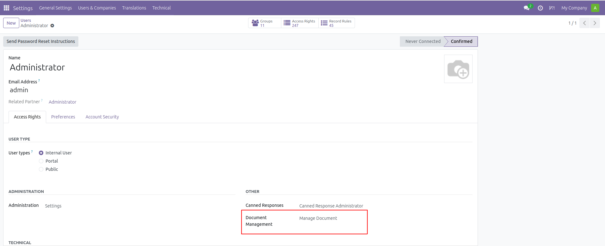

.. |badge1| image:: https://img.shields.io/badge/licence-AGPL--3-blue.svg
    :alt: License: AGPL-3

.. |badge2| image:: https://img.shields.io/badge/github-Smile--SA%2Fodoo_addons-lightgray.png?logo=github
    :target: https://github.com/Smile-SA/odoo_addons/tree/18.0/smile_document
    :alt: Smile-SA/odoo_addons

|badge1| |badge2|

=========================
Smile Document Management
=========================

This module allows you to define types on documents.

It also allows you to define an expiry date on documents and to archive them.

.. contents:: Table of contents
   :local:

Configuration
=============

If you want to add your own document types, add your user to the "Manage Document" group:
- Navigate to **Users -> Your User -> Access Rights tab -> Other -> Document Management** and set it to **Manage Document**.

Usage
=====

To use this module, follow these steps:

1. **Go to the Documents menu and create a new document type.**

   .. image:: static/description/document_view_list.png
      :alt: Document List View
      :width: 850px

2. **Upload a document and assign it a type.**

   .. image:: static/description/document_view_form.png
      :alt: Document Form View
      :width: 850px

3. **Set an expiry date for the document if needed.**

   .. image:: static/description/document_expired.png
      :alt: Document Expired Status
      :width: 850px

4. **Archive the document when it is no longer valid.**

   .. image:: static/description/document_archived.png
      :alt: Document Archived Status
      :width: 850px

5. **Validate the document when it is ready.**

   .. image:: static/description/document_valid.png
      :alt: Document Valid Status
      :width: 850px

Bug Tracker
===========

Bugs are tracked on `GitHub Issues <https://github.com/Smile-SA/odoo_addons/issues>`_.
In case of trouble, please check there if your issue has already been reported.
If you spotted it first, help us smash it by providing a detailed and welcomed feedback
`here <https://github.com/Smile-SA/odoo_addons/issues/new?body=module:%20smile_document%0Aversion:%2018.0%0A%0A**Steps%20to%20reproduce**%0A-%20...%0A%0A**Current%20behavior**%0A%0A**Expected%20behavior**>`_.

Do not contact contributors directly about support or help with technical issues.

Credits
=======

Contributors
------------

- Smile SA Development Team

Maintainer
----------

This module is maintained by Smile SA.

Since 1991 Smile has been a pioneer of technology and also the European expert in open source solutions.