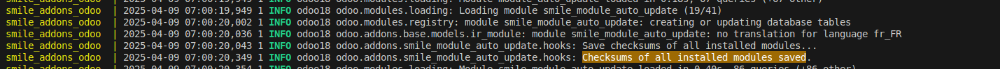

.. |badge1| image:: https://img.shields.io/badge/licence-AGPL--3-blue.svg
    :alt: License: AGPL-3

.. |badge2| image:: https://img.shields.io/badge/github-Smile--SA%2Fodoo_addons-lightgray.png?logo=github
    :target: https://github.com/Smile-SA/odoo_addons/tree/18.0/smile_module_auto_update
    :alt: Smile-SA/odoo_addons

.. |badge3| image:: https://img.shields.io/badge/maturity-Beta-yellow.png
    :target: https://odoo-community.org/page/development-status
    :alt: Beta

|badge1| |badge2| |badge3|

===========================
Smile Module Auto Update
===========================

This module helps you automatically upgrade modules changed since the last server restart.

As the module is based on 
`smile_upgrade <https://apps.odoo.com/apps/modules/18.0/smile_upgrade>`_,
you can continue to use upgrades to execute `pre-load` and `post-load` scripts,
but filling the `modules_to_upgrade` list is no longer necessary.

**Table of contents**

.. contents::
   :local:

Requirements
============

Please ensure the following modules are available in your addons path:

- `module_auto_update <https://apps.odoo.com/apps/modules/18.0/module_auto_update/>`_
- `smile_upgrade <https://apps.odoo.com/apps/modules/18.0/smile_upgrade>`_

Usage
=====

Follow these steps to use the Smile Module Auto Update:

1. Install the module in your Odoo instance.
2. Modify the source code of one or more modules in your addons path.
3. Restart your Odoo server. The Smile Module Auto Update will automatically detect the modified modules and upgrade them.
4. Check the logs to confirm the successful execution of the module upgrade process.

Below is an example of a successful execution of the Smile Module Auto Update:

For more details, please consult the documentation of the dependency modules.

Bug Tracker
===========

Bugs are tracked on `GitHub Issues <https://github.com/Smile-SA/odoo_addons/issues>`_.
In case of trouble, please check there if your issue has already been reported.
If you spotted it first, help us smash it by providing detailed and welcomed feedback
`here <https://github.com/Smile-SA/odoo_addons/issues/new?body=module:%20smile_module_auto_update%0Aversion:%218.0%0A%0A**Steps%20to%20reproduce**%0A-%20...%0A%0A**Current%20behavior**%0A%0A**Expected%20behavior**>`_.

Do not contact contributors directly about support or help with technical issues.

Credits
=======

Contributors
------------

* Isabelle RICHARD
* Smile SA Development Team

Maintainer
----------

This module is maintained by Smile SA.

Since 1991 Smile has been a pioneer of technology and also the European expert in open source solutions.